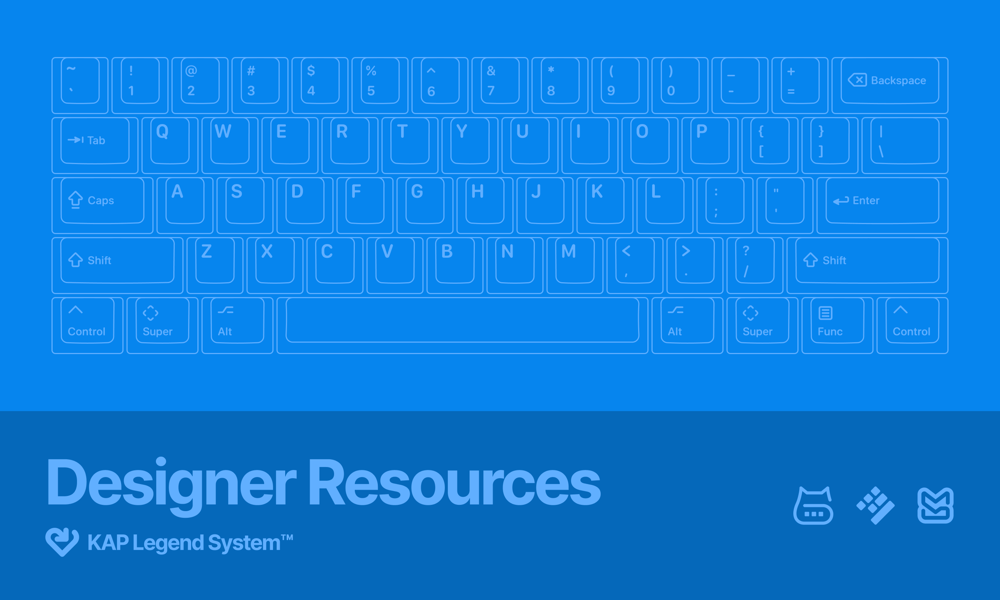

# KAP Legend System



A repository of keycap legends for the KAP doubleshot cylindrical profile
keycaps, designed by kapowaz (Ben Darlow).

### Running docs site locally

This website is built using [Docusaurus](https://docusaurus.io/), a modern
static website generator.

#### Installation

```
$ yarn
```

#### Local Development

```
$ yarn start
```

This command starts a local development server and opens up a browser window.
Most changes are reflected live without having to restart the server.

#### Build

```
$ yarn build
```

This command generates static content into the `build` directory and can be
served using any static contents hosting service.

#### Deployment

Using SSH:

```
$ USE_SSH=true yarn deploy
```

Not using SSH:

```
$ GIT_USER=<Your GitHub username> yarn deploy
```

If you are using GitHub pages for hosting, this command is a convenient way to
build the website and push to the `gh-pages` branch.

#### Contributing project updates

If you have a KAP project you’d like to list on the site, you can create a pull
request to this repository including the details. For a new project, you will
need to make the following main changes:

1. Add a project image 1600px wide (ideally saved as a JPEG image no more than
   200Kb in size) to `src/projects/images/` following the naming convention
   `kap-<project name>.jpg`
2. In `src/projects/index.ts`, add an image import for the preview image at the
   bottom of the block of existing image imports (starting around line 78) with
   a name following the convention of the existing images; see the example
   below.
3. Add a new item to the bottom of the array `projects` of type `IProject`,
   following the structure described below. Note that the project uses
   TypeScript and so you may need to actually install dependencies (i.e. with
   yarn, described above) to ensure your added project has the correct
   properties.

Your image import should follow this format:

```ts
import previewImageYourProject from './images/kap-your-project.jpg';
```

A project should be an object with the following properties:

```ts
{
  name: 'KAP Project Name',
  id: 'kap-project-name', // needs to be a unique identifier
  previewImage: previewImageYourProject,
  designer: 'Your name',
  modifiers: 'Default | Icon | Text | Hybrid', // use an appropriate existing value
  sublegends: 'None | Hangul | Hiragana | Katakana | Custom',
  colors: {
    main: '#000000', // hex colour for the main colour of your set, usually the base colour for your keycaps
    legends: ['#FFFFFF', '#AABBCC'], // any other significant colours in your set, starting with the legend colour
  },
  status: 'Design | Interest Check | Group Buy | Manufacturing | Shipping', // choose an appropriate status for your project
}
```

Once your project is shipping you can add a `vendors` key to the object, with an
array of vendors. The type for each of these is a little more strict, as the
`name` property needs to correspond to an existing `VendorName` in the type
listed at the top of the file. If you are offering your keycaps through a vendor
not listed here, create an issue on this project to have them added.
