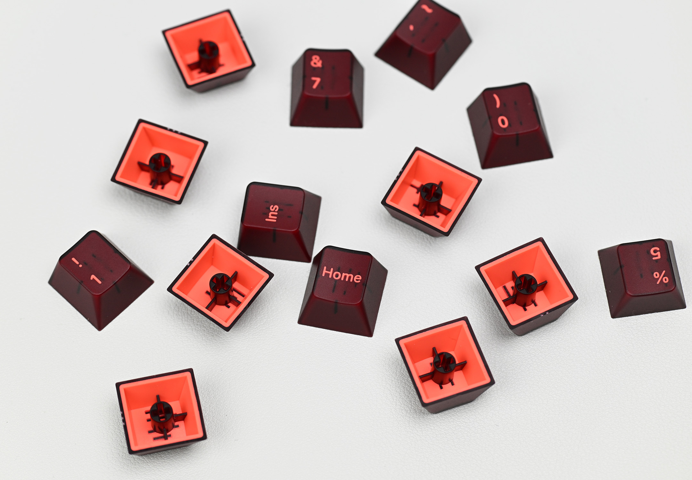
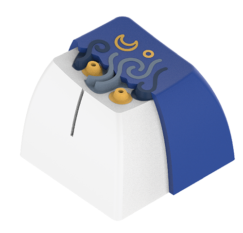
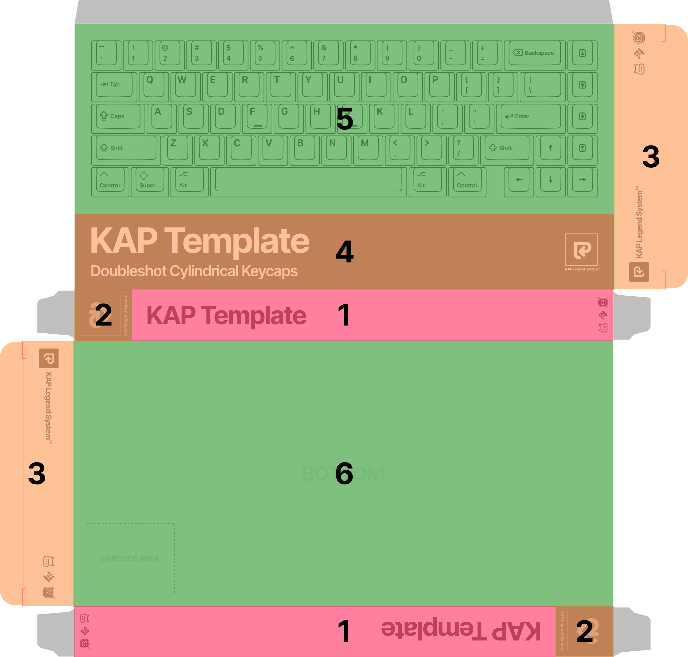

# Designers’ Guide

  

The KAP Legend System is a versatile and modern set of keycap legends in the
cylindrical ‘Cherry’ keycap profile for creating doubleshot keycaps (with a
thickness of 1.7mm), designed by [kapowaz][kapowaz] and manufactured by [Big
Cat][xbigcat], in partnership with [Keyreative][keyreative]. This Designers’
Guide is for anyone who is interested in creating and selling keycap sets using
these legends.

- [Materials](#materials)
- [Available Resources](#available-resources)
  - [Kit Templates](#kit-templates)
  - [Packaging Templates](#packaging-templates)
  - [Modifier Lettering](#modifier-lettering)
  - [UV Legend Sheets](#uv-legend-sheets)
- [Core Concepts](#core-concepts)
  - [Kit selection](#kit-selection)
  - [Colors](#colors)
- [Custom kits](#custom-kits)
  - [Tolerances](#tolerances)
    - [Line Width](#line-width)
    - [R-angle](#r-angle)
    - [Interval](#interval)
    - [Enclosed area](#enclosed-area)
    - [Icon area](#icon-area)
    - [Safe zone](#safe-zone)
  - [Custom legends](#custom-legends)
  - [Custom Icons](#custom-icons)
- [Blender and Keyboard Render Kit](#blender-and-keyboard-render-kit)

## Materials

Keyreative supports a range of manufacturing techniques using ABS, PBT or
Polycarbonate plastics. As well as standard doubleshot injection moulding,
Keyreative can use a ‘hybrid’ dyesub/injection moulding technique (illustrated
in the cutaway image below).

The three main types of plastic supported by KAP are:

1. PBT (Polybutylene terephthalate)
2. ABS (Acrylonitrile butadiene styrene)
3. Polycarbonate

Each of these plastics has advantages and limitations, depending on what your
design goals are, so it’s worth bearing these limitations in mind when designing
your set.

* **Hybrid doubleshot**: requires the inner (legend) shot be manufactured with
  PBT
* **Dyesublimation**: requires that any part of the keycap with dyesub legends
  be manufactured with PBT
* **Transparency**: transparent parts need to be ABS or Polycarbonate;
  Polycarbonate can be used for the inner (legend) shot only
* **UV printing**: the outer shot must use ABS, as UV printing does not
  adhere well to PBT. Note that UV legends have much lower durability than
  doubleshot or dyesub legends.
* **Durability**: PBT is significantly more wear-resistant than ABS, the latter
  of which will go smooth/shiny on the top surface much more quickly with usage.

  

The hybrid doubleshot process allows the creation of keycaps with the crisp
legend edges of doubleshot keys, but with the flexibility of colours associated
with a dyesublimation process. With this technique, an initial shot of white PBT
is first used to create the legends, before legend colours are added using a
dyesub technique. Finally, the outer keycap is moulded as a second shot.

## Available Resources

This repository has two main purposes:

1. Provides a ‘source of truth’ for the original production-ready design files
2. Provide keycap designers with templates and other resources to design keycap
  sets

Designers creating their own keycap sets based on the KAP Legend System should
mostly focus on the files within the `Designer Resources/` section of the
repository, which include:

* Documentation (i.e. this guide)
* Kit templates
* Packaging templates
* Modifier key legend lettering templates
* UV texture maps (i.e. for use with [Keyboard Render Kit][krk])

In addition to this GitHub repository, there is also a [Google
Drive][google-drive] containing the keycap CAD files, both as STEP format, and
converted for Blender (suitable for use with [Keyboard Render
Kit](#blender-and-keyboard-render-kit), which is discussed further down).

### Kit Templates

There are two basic template files available within the Designer Resources that
you can use as a basis for creating production-ready design files:

* [Color Previews.pdf][color-previews]
* [Default Kits.pdf][default-kits]

Each of these files contains an artboard for each of the default kits already
available. The process for using these to then create your sets is discussed in
more depth below, in the section [Core concepts](#core-concepts).

### Packaging Templates

The base kit(s) for KAP Legend System ship in a reusable, stackable plastic tray
(moulded from recycled waste plastic) intended to store keycaps when not in use.
This tray is shipped in a cardboard outer sleeve, for which [a PDF template is
provided][tray-sleeve-box] in this repository.

The packaging template has a specific layout and structure that is intended to
help customers easily identify KAP Legend System keycap sets as belonging to the
overall family, so elements of the design are common to all KAP sets.
As such, there are certain parts of the packaging template that can be
customised, and other parts which should remain relatively unchanged. As always,
if you need guidance reach out to us to discuss.

  

1. The box sides should be updated with your kit name (i.e. ‘KAP Your Set Name’)
  using the Inter Bold font. The size and colour of this text, the background
  colour and the small logos should not be changed (i.e. they should remain
  black and white). No additional design elements should be added to the sides.
  These areas are marked in red on the diagram above.
2. The colours used for the KAP Legend System logo on the box sides can be
  adjusted to suit the remainder of the box design, subject to design approval
  prior to manufacturing. These areas are marked in orange on the diagram above.
3. The layout and design on the box flaps should be unchanged, although the
  colours (including background) can be adjusted to suit your needs. No
  additional design elements should be added in this area. These areas are
  marked in orange on the diagram above.
4. The lower section of the box top should be updated to show your kit name, but
  otherwise the layout and design of this area should be unchanged. Again, you
  can update the colours as you see fit. This area is marked in orange on the diagram
  above.
5. The top section of the box top can be updated to contain whatever design best
  fits your needs. This area is marked in green on the diagram above.
6. The box bottom can contain whatever design suits your needs. Note that an
  area for a 50mm × 40mm barcode sticker has been included: this should remain
  on the bottom of the box, although the location can be adjusted to suit your
  design. This area is marked in green on the diagram above.

Final design approval is required ahead of production, so if you have a box
design in mind that doesn’t fit within these constraints, please get in touch
with Keyreative to discuss your requirements.

### Modifier Lettering

The file [Modifier Legend Lettering.pdf][modifier-legend-lettering] contains all
of the lettering used to create modifier key legends. These are heavily-modified
versions of the original letterforms, to ensure that any modifier legends using
them meet the required production constraints for tolerances etc. Using these is
discussed in more depth in the section on [custom legends](#custom-legends).

### UV Legend Sheets

If you’re using [Keyboard Render Kit][krk], you can use these instead of the
default legends to quickly create sample renders for your designs. You can find
these (in much higher resolution than the example above) [here][krk-legends].

## Core Concepts

There are at present over 400 individual keycap legends available in the KAP
Legend System (when including the same legend appearing at different keycap
sizes, and on different rows). This means whilst the system is incredibly
versatile and flexible, it can also be a little overwhelming for a designer
setting out to make a keycap set.

To simplify the process of picking which legends to use, we have created several
template kits with support for a range of common keyboard layouts, as well as
child kits with support for more esoteric layouts, novelties and other customer
personalisation.

You can find PDF files containing all of these kits in two forms: [Color
Previews.pdf][color-previews], which contains each kit in a form suitable for
providing physical color information, and [Default Kits.pdf][default-kits],
which contains a more schematic-like layout of each kit, indicating safe zones
etc.

To create a custom keycap project with everything needed to get it into
production and put on sale there are essentially two major components you need
to decide on:

1. Which kits to offer
2. What colors to use in your set

There are potentially other decisions to make and other design files to produce
(such as artwork for novelty keys, and packaging), but these two are the main
elements of any project.

### Kit selection

There are a number of generic base kits in this repository (each of which has support
for ANSI and ISO-UK layouts):

* `Base Kit` — using the default icon & text legend modifiers
* `Base Kit (Text Modifiers)` — using text-only modifiers
* `Base Kit (Icon Modifiers)` — using icon-only modifiers
* `Base Kit (Hangul)` — default modifiers and Hangul sublegends
* `Base Kit (Katakana)` — default modifiers and Katakana sublegends
* `Base Kit (Hiragana)` — default modifiers and Hiragana sublegends
* `Base Kit (Ukraine Cyrillic)` — default modifiers and Ukraine Cyrillic sublegends
* `Base Kit (US International)` — default modifiers and sublegends for US International layouts

<small>*An additional `Base Kit (German)` layout exists, with kitting explicitly
intended for German keyboard layouts; it is however not suitable for most
projects, unless you are specifically targeting the German market.</small>

Unless you have specific layouts in mind that require changing the kitting, we
recommend you choose one of these three default base kits as your base kit, and
add support for additional layouts via child kits. To that end, we also provide
the following generic child kits:

* `40s Kit` — additional support for ergo, ortholinear and 40% keyboard layouts
* `Icon Alternates Kit` — additional icon-only versions of 1u-size modifier keys
  (e.g. paging keys) to complement a text-only base kit
* `Icon Modifiers Kit` — a set of alternative icon-only modifiers to complement
  either the default icon & text, or text-only base kits
* `Text Modifiers Kit` — a set of alternative text-only modifiers to complement
  either the default icon & text, or icon-only base kits
* `NorDe Kit` — additional language support for Nordic & German layouts
* `Mac Kit` — additional modifiers and alternate Function row keys to support
  Mac layouts
* `French Kit` — additional language support for French (France) and French
  (Belgium) layouts
* `Spanish Kit` — additional language support for Spanish (Spain) and Spanish
  (Latin America) layouts
* `Hangul Kit` — additional alphanumeric keys with Hangul sublegends, plus
  Hangul-specific modifiers
* `Katakana Kit` — additional alphanumeric keys with Katakana sublegends,
  intended for layouts with a Katakana-inspired aesthetic
* `Hiragana Kit` — additional alphanumeric keys with Hiragana sublegends,
  intended for layouts with a Hiragana-inspired aesthetic
* `Ukraine Cyrillic Kit` — additional alphanumeric keys with Ukraine Cyrillic
  sublegends, as well as additional numeric keys to support these layouts (and a
  _Tryzub_ R4 1.0u novelty key)
* `US International Kit` — additional alphanumeric keys with sublegends to
  support the US International layout.
* `Katakana JIS Kit` — Katakana sublegend alpha keys, with additional modifiers
  and short spacebars to support JIS layouts.
* `Hiragana JIS Kit` — Hiragana sublegend alpha keys, with additional modifiers
  and short spacebars to support JIS layouts.

Each of these kit diagrams can be found (on a separate artboard) within the file
[Default Kits.pdf][default-kits]. Note that some of these kits are based on
newer keycaps which are subject to manufacturing. Check with Keyreative to make
sure the keys you want to use are available for production.

### Colors

The kit templates follow a very particular format, intended to provide engineers
and production managers at Keyreative with all the necessary information they
need to manufacture the product, specifically:

* Which legends are used?
* …on which sized keycaps?
* …for which row profile?
* …and in which color?

Conceptually, the generic kits have three different color of keycap: _Alpha_,
_Modifier_ and _Accent_; each of these then has two colors (one for the
_legend_, and one for the _base_), for a hypothetical total of six colors.

The kit templates use another three other colors to represent important
information: _magenta_, to indicate the top edge of the keycap surface; _cyan_
to represent the ‘safe area’ for the legend, and _blue_ for labels indicating
keycap size. A list is provided on each template to illustrate these colors:

  

The templates provided in the Designer Resources don’t specify any _physical
colors_ to use for each of these named values; this is up to the keycap designer
to decide. You could also choose to use the same color for two or more of them
(for example, you might not use a different color scheme for accents or
modifiers, and simply use the same color as alpha keys).

The [safe zone](#safe-zone) line is an important concept should you decide to
create [custom legends](#custom-legends), and is discussed later on.

## Custom kits

If you want to create your own custom kit, either using new legends (such as
novelties), or by combining other existing legends, you can do so using the
existing template.

To add existing keys to your kit, you should navigate within the GitHub
repository to the [`Keys/`][keys] folder, where you can find legends saved as SVG files,
grouped by row (N.B. Keyreative follows the Chinese manufacturing convention of
numbering rows from the bottom up, so the spacebar is R1, and number row is R4).

If you’re creating entirely new, custom legends to use within your set, you
should ensure that your design follows the below requirements.

### Tolerances

When creating custom legends, you must observe certain tolerance values to
ensure that the design can actually be physically manufactured. There are five
key metrics which are of significance here:

1. **Line width** — the width of individual strokes on letters or icons
2. **R-angle** — the smallest possible radius of _internal_ corners within a
   legend
3. **Interval** — the gap between individual stroked or filled elements within a
   legend
4. **Enclosed area** — the size of any internal gaps within legends, e.g. the
   centre of a letter O
5. **Icon area** — the relative proportion of the keycap legend that is filled

#### Line width

  

* Ideal: `>0.5mm`
* Good: `>0.32mm`
* Difficult `>0.22mm`

Stroke widths below `0.22mm` in thickness might be possible, but should be
avoided.

#### R-angle

  

This metric concerns the sharpness of any internal corners on your legend. It is
best visualised as the corner radius on a sharp point in mm. You can test this
in design tools by checking if a circle with the desired radius can fit snugly
inside the internal corner, covering the whole area the corner extends into.

* Ideal: `>0.6mm`
* Good: `>0.3mm`
* Difficult: `>0.1mm`

Corner radii below `0.1mm` should be avoided.

#### Interval

  

Similar to line width, this is a simple metric for the gap between filled areas
within a legend.

* Good: `>0.5mm`
* Difficult: `>0.3mm`

Interval gaps of below `0.3mm` between filled areas should be avoided.

#### Enclosed area

  

To ensure legend molds can be manufactured, the size of non-filled, enclosed
areas should be limited to above a certain size.

* Ideal: `>1mm`
* Good: `>0.5mm`
* Difficult: `>0.25mm`

Enclosed areas below `0.25mm` wide between filled areas should be avoided.

#### Icon area

  

This relates to the relative proportion of the keycap legend that is filled
compared to the base keycap color.

* Ideal: `<10%`
* Good: `<60%`
* Difficult: `<80%`

#### Safe zone

  

As well as tolerance constraints, custom legends must be a safe distance from
the edge of the keycap top surface. To that end, there is a visible ‘safe zone’
indicated in cyan on keycap templates. When creating custom legends you must
ensure that your legend is no closer than `0.3mm` to this line (in Illustrator,
setting a stroke of `0.6mm` on that outline will allow you to visualise this
distance).

### Custom legends

  

If you wish to include a new modifier legend that includes text, refer to the
file [Modifier Legend Lettering.pdf][modifier-legend-lettering] which contains
the adjusted letterforms for modifier legends; these letters have all been
tweaked to ensure they meet tolerance requirements. The template contains each
letter on a common baseline, so you can manually assemble these letters provided
they remain on this same baseline and you follow the tolerance requirements for
[legend intervals](#interval).

If you need any assistance in creating a modifier legend for a key, reach out to
us and we can assist.

### Custom Icons

The default icons used in KAP Legend System for modifier keys follow a set of
conventions to ensure they all look like they’re part of the same family. We
recommend following the same conventions when you create custom icons for your
sets, to help them feel ‘at home’ when used alongside other KAP Legend System
keycaps, as well as (potentially) allow for their re-use in other keycap sets.

  

If you’re creating something completely custom (e.g. for a novelty) you can
disregard these rules, but if you are creating modifier keys that combine icon
plus text (as per the default legends), then following them will help you create
something that is visually cohesive with the rest of the KAP Legend System.

#### Icon canvas

  

Icons should sit within a `6.35mm × 6.35mm` bounding box, and ideally no
elements of the icon should leave this area. To ensure icons have a similar
‘optical size’, you shouldn’t try to fill this space, but rather look for other
icons that have a similar silhouette to yours as a guide for sizing.

#### Stroke widths

  

Stroked lines that form part of an icon should have a stroke width of `0.5mm`.
For corners on (for example) rectangles, these should have a border radius of
`0.5mm`; this ensures that corners will be appropriately rounded, without sharp
interior edges that are difficult to create molds from.

For other corners (for example the cross in the Delete symbol) ensure that these
have an external border radius of `0.05mm`, which will again help avoid sharp
edges.

## Blender and Keyboard Render Kit

An extensive guide on how to use KAP Legend System with Blender and [Keyboard
Render Kit][krk] is beyond the scope of this guide; however, if you are
comfortable using these tools, you can can add the [aforementioned UV
textures](#uv-legend-sheets) from [`Designer Resources/KRK/`][krk-legends] to an
existing KRK Blender file to replace the existing legends, or you can import the
3D models available in the [Google Drive][google-drive]; the latter contain
separate geometry for each shot, allowing you to render doubleshot keycaps with
(for example) transparent materials.

[kapowaz]: https://kapowaz.industries
[xbigcat]: https://www.xbigcat.com
[keyreative]: https://keyreative.store
[google-drive]: https://drive.google.com/drive/folders/1kV-D5MELIa8oaznFhoh9b9LvV5FcjUj3
[krk]: https://keyboardrenderkit.readthedocs.io/
[krk-legends]: https://github.com/kapowaz/kap-legends/blob/main/Designer%20Resources/KRK/
[keys]: https://github.com/kapowaz/kap-legends/blob/main/Production%20Files/Keys
[color-previews]: https://github.com/kapowaz/kap-legends/blob/main/Designer%20Resources/Templates/Color%20Previews.pdf
[default-kits]: https://github.com/kapowaz/kap-legends/blob/main/Designer%20Resources/Templates/Default%20Kits.pdf
[modifier-legend-lettering]: https://github.com/kapowaz/kap-legends/blob/main/Designer%20Resources/Templates/Modifier%20Legend%20Lettering.pdf
[tray-sleeve-box]: https://github.com/kapowaz/kap-legends/blob/main/Designer%20Resources/Templates/Tray%20Sleeve%20Box.pdf
[inter-font]: https://rsms.me/inter/
